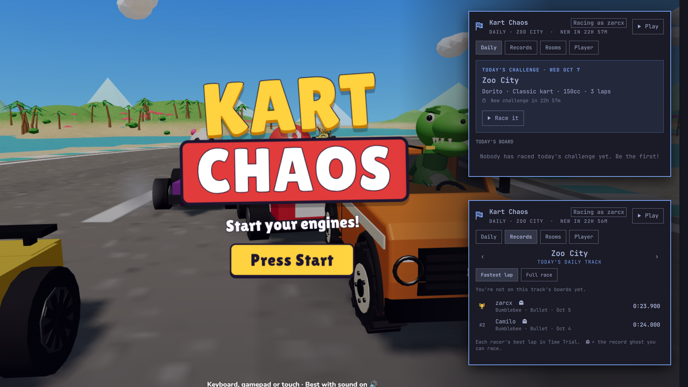

# Kart Chaos (grivera.kartchaos)


An Omarchy bar companion for [Kart Chaos](https://kartchaos.com), the browser kart racer.
It shows today's Daily Challenge, the Time Trial records, and open online rooms. You get a
notification when someone beats one of your times.



- **Daily** shows today's challenge (track, racer, kart, class), the time until the next one, today's board with your place, and yesterday's podium.
- **Records** shows the fastest-lap and full-race Time Trial boards for every track, with your entries highlighted.
- **Rooms** lists open online rooms, and each has a Join button.
- **Player** links your player code and holds the settings.

When someone passes one of your Time Trial times or overtakes you on the daily board, you get a notification. Click it to jump into the game. With the "daily rank" setting on, the bar shows your place on today's board, and a dot appears when you haven't raced today's challenge yet.

## Install

Use Omarchy's plugin manager:

```
omarchy plugin add https://github.com/grivera82/omarchy-kartchaos.git --enable
```

This clones the plugin into `~/.config/omarchy/plugins/grivera.kartchaos`, checks it, and adds the widget to your bar. Without `--enable`, you can turn it on later with:

```
omarchy plugin enable grivera.kartchaos --section right
```

The only requirement is `python3`, which Omarchy already has. The plugin speaks the game's WebSocket protocol using only the standard library, so there's nothing else to install and no API key. Games open in your browser through `omarchy-launch-webapp` when it's available, and `xdg-open` otherwise.

To update or uninstall:

```
omarchy plugin update grivera.kartchaos
omarchy plugin disable grivera.kartchaos   # hide it but keep it installed
omarchy plugin remove grivera.kartchaos    # delete it
rm -rf ~/.cache/grivera-kartchaos ~/.local/state/grivera-kartchaos   # optional: cached data, settings and your link
```

The plugin writes only to those two folders.

## Linking your player

In Kart Chaos, open ⚙️ Settings and copy your player code (or its link), then paste it into the Player tab. The plugin links itself the same way a second device would, so it can mark your entries. It only reads the boards: it never races, posts times, or shows you as online. The code goes to the plugin over stdin and is never put on a command line. The linked id is stored in `~/.local/state/grivera-kartchaos/account.json` with mode 0600. Unlink removes it.

Each phone or browser is its own player until you link it to another one in the game. If the Player tab says none of your times are on the boards, copy the code from the device you race on instead.

## Controls

| Where | What |
| --- | --- |
| Bar, left click | Open the panel |
| Bar, right click | Open the game |
| Bar, middle click | Refresh |
| Panel `1`–`4` | Switch tabs |
| Panel `h` / `l` | Previous / next track (Records) |
| Panel `b` | Lap / full-race board (Records) |
| Panel `p` | Play |
| Panel `r` | Refresh |

## CLI

```sh
bin/kartchaos status     # today's challenge, your ranks, open rooms
bin/kartchaos daily      # one line for scripts
```

## How it works

The daemon (`lib/kartchaos.py`) polls the game server every three minutes, and right away when you open the panel. It sends the same one-off `daily` and `records` requests the game makes for its boards. The server doesn't say which track is today's daily, so the plugin runs the same seeded rotation as the game's `js/daily.js`. It re-reads that file and the track list from the site once a day, so new tracks show up without a plugin update.

"Someone beat you" alerts come from comparing your rank on each board between polls. The plugin doesn't use the game's own "beaten" request, because that request hands each note over only once, and the game would then never show you its popup.

## License

MIT
